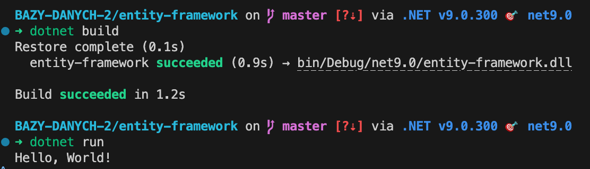
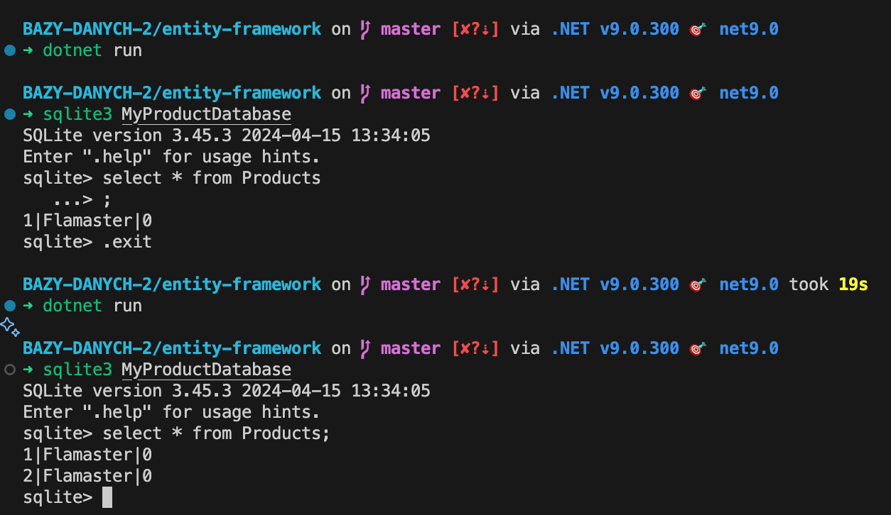

# Entity Framework
## Autorzy: Szymon Migas, Dawid Żak

# Część I
Weryfikacja wersji dotnet  framework oraz utworzenie nowej aplikacji konsolowej w edytorze Visual Studio Code.


Próba zbudowania oraz uruchomienia aplikacji:



Stworzona klasa `Product`


W pkiku `prodContext.cs` stworzyliśmy klase `ProdContext` dziedziczącą po `DbContext`, która będzie odpowiedzialna za komunikację z bazą danych.


Po otrzymaniu komunikatu o błędzie, dodaliśmy do pliku
```cs
using Microsoft.EntityFrameworkCore;
```
Nie rozwiązało to jednak problemu.


Po dodaniu dod projektu pakietu komendą 

```bash
dotnet add package Microsoft.EntityFrameworkCore
```


Spróbowaliśmy ponownie zbudować projekt, wszystko przebiegło pomyślnie.


Następnie utworzyliśmy kolekcję obiektów, którymi EF będzie zarządzać:


Próda przygotowania kodu odpowiedzialnego za migracje bazy danych:


Ponieważ otrzymaliśmy komunikat o błędzie, instalujemy Tools do Entity Framework Core:


Kolejna próba wygenerowania migracji również kończy się błędem, więc dodajemy pakiet `Microsoft.EntityFrameworkCore.Design`:


Po ponownej próbie wygenerowania migracji, otrzymujemy kolejny komunikat o błędzie:


Ponieważ nigdzie nie zdefiniowaliśmy bazy z której EF ma korzystać,

dodajemy do klasy `ProdContext` metodę `OnConfiguring`, która ustawia bazę danych na SQLite:


Otrzymujemy kolejny błąd:


Dodajemy więc do projektu pakiet `Microsoft.EntityFrameworkCore.Sqlite`:


Tym razem próba wygenerowania migracji kończy się sukcesem:


Aktualizujemy bazę danych poleceniem
```bash
dotnet ef database update
```

W ten sposób otrzymujemy plik bazy danych `MyProductDatabase`


W pliku `Program.cs` dodajemy kod odpowiedzialny za dodawanie produktu do bazy danych:


Poleceniem `sqlite3` otwieramy bazę danych i sprawdzamy czy produkt został dodany:




Do programu dopisujemy kod odpowiedzialny za pobieranie wszystkich produktów z bazy danych oraz ich wyświetlanie:


Teraz dodamy kod odpowiedzialny za dodanie nowego produktu, podczas uruchomienia programu:


# Część II
## Zadanie 1.

Plik `Supplier.cs` zawiera klasę `Supplier`, która będzie reprezentować dostawcę produktów:

```cs
// Dodano klasę Supplier
public class Supplier
{
    public int SupplierId { get; set; }
    public string? CompanyName { get; set; }
    public string? Street { get; set; }
    public string? City { get; set; }
}
```


Plik `Product.cs`:
```cs

public class Product
{
    public int ProductId { get; set; }
    public string? ProductName { get; set; }
    public int UnitsInStock { get; set; }
    // Dodano relacje z Supplier
    public Supplier? Supplier { get; set; }
}
```

Plik `ProdContext.cs`:
```cs
using Microsoft.EntityFrameworkCore;
public class ProdContext : DbContext
{
    public DbSet<Product> Products { get; set; }
    // Dodano DbSet dla Supplier
    public DbSet<Supplier> Suppliers { get; set; }

    protected override void OnConfiguring(DbContextOptionsBuilder optionsBuilder)
    {
        base.OnConfiguring(optionsBuilder);
        optionsBuilder.UseSqlite("Datasource=MyProductDatabase");
    }
}
```

Plik `Program.cs`:
```cs
using System;
using System.Linq;
var prodContext = new ProdContext();
var supplier = new Supplier
{
    CompanyName = "firma",
    Street = "fajna",
    City = "Krakow"
};
prodContext.Suppliers.Add(supplier);
prodContext.SaveChanges();
var lastProduct = prodContext.Products
    .OrderByDescending(p => p.ProductId)
    .FirstOrDefault();

if (lastProduct != null)
{
    lastProduct.Supplier = supplier;
    prodContext.SaveChanges();
}
```

Prezentacja działania zastosowanych zmian:

### Migracja oraz aktualizacja bazy danych:
Migracja bazy danych została zaktualizowana, aby uwzględnić nową klasę `Supplier` oraz relację z klasą `Product`.


Schematy powstałych tabel:


Wyniki po dodaniu dostawcy do ostatnio dodanego produktu:


## Zadanie 2.


Plik `Supplier.cs`:

```cs
public class Supplier
{
    public int SupplierId { get; set; }
    public string? CompanyName { get; set; }
    public string? Street { get; set; }
    public string? City { get; set; }
    // Dodano relację z Product
    public ICollection<Product> Supplies { get; set; } = new List<Product>();
}
```


Plik `Product.cs`:
```cs
public class Product
{
    public int ProductId { get; set; }
    public string? ProductName { get; set; }
    public int UnitsInStock { get; set; }
    // Usunięto relacje z Supplier
}
```

Plik `ProdContext.cs`:
```cs
using Microsoft.EntityFrameworkCore;
public class ProdContext : DbContext
{
    public DbSet<Product> Products { get; set; }
    // Dodano DbSet dla Supplier
    public DbSet<Supplier> Suppliers { get; set; }

    protected override void OnConfiguring(DbContextOptionsBuilder optionsBuilder)
    {
        base.OnConfiguring(optionsBuilder);
        optionsBuilder.UseSqlite("Datasource=MyProductDatabase");
    }
}
```

Plik `Program.cs`:
```cs
using System;
using System.Linq;
var prodContext = new ProdContext();


var supplier = new Supplier
{
    CompanyName = "firma2",
    Street = "fajna2",
    City = "Krakow2"
};
prodContext.Suppliers.Add(supplier);

var product1 = new Product
{
    ProductName = "Produkt1",
    UnitsInStock = 10
};
var product2 = new Product
{
    ProductName = "Produkt2",
    UnitsInStock = 20
};
var product3 = new Product
{
    ProductName = "Produkt3",
    UnitsInStock = 30
};

prodContext.Products.AddRange(product1, product2, product3);

supplier.Supplies.Add(product1);
supplier.Supplies.Add(product2);
supplier.Supplies.Add(product3);

prodContext.SaveChanges();
```

Wyniki migracji i działania programu:


Schematy powstałych tabel:


## Zadanie 3.


Plik `Supplier.cs`:

```cs
// Bez zmian
public class Supplier
{
    public int SupplierId { get; set; }
    public string? CompanyName { get; set; }
    public string? Street { get; set; }
    public string? City { get; set; }

    public ICollection<Product> Supplies { get; set; } = new List<Product>();
}
```


Plik `Product.cs`:
```cs
public class Product
{
    public int ProductId { get; set; }
    public string? ProductName { get; set; }
    public int UnitsInStock { get; set; }
    // Ponownie dodano relację z Supplier
    public Supplier? Supplier { get; set; }
}
```

Plik `ProdContext.cs`:
```cs
using Microsoft.EntityFrameworkCore;
public class ProdContext : DbContext
{
    public DbSet<Product> Products { get; set; }

    public DbSet<Supplier> Suppliers { get; set; }

    protected override void OnConfiguring(DbContextOptionsBuilder optionsBuilder)
    {
        base.OnConfiguring(optionsBuilder);
        optionsBuilder.UseSqlite("Datasource=MyProductDatabase");
    }
}
```

Plik `Program.cs`:
```cs
using System;
using System.Linq;
var prodContext = new ProdContext();

var supplier = new Supplier
{
    CompanyName = "firma2",
    Street = "fajna2",
    City = "Krakow2"
};
prodContext.Suppliers.Add(supplier);

var product1 = new Product
{
    ProductName = "Produkt1",
    UnitsInStock = 10,
    Supplier = supplier // Ustawienie relacji z dostawcą
};
var product2 = new Product
{
    ProductName = "Produkt2",
    UnitsInStock = 20
    Supplier = supplier // Ustawienie relacji z dostawcą
};
var product3 = new Product
{
    ProductName = "Produkt3",
    UnitsInStock = 30
    Supplier = supplier // Ustawienie relacji z dostawcą
};

prodContext.Products.AddRange(product1, product2, product3);

supplier.Supplies.Add(product1);
supplier.Supplies.Add(product2);
supplier.Supplies.Add(product3);

prodContext.SaveChanges();
```

Polecenie migracji i aktualizacji bazy danych:


Wyniki działania programu:


Schematy powstałych tabel:


## Zadanie 4.
Plik `Product.cs`:
```cs

public class Product
{
    public int ProductId { get; set; }
    public string? ProductName { get; set; }
    public int UnitsInStock { get; set; }
    public Supplier? Supplier { get; set; }
    // Dodano relację z Invoice
    public ICollection<Invoice> Invoices { get; set; } = new List<Invoice>();
}
```

Plik `Invoice.cs`:
```cs
// Dodano klasę Invoice
public class Invoice
{
    public int InvoiceId { get; set; }
    public int InvoiceNumber { get; set; }
    public int Quantity { get; set; }
    public ICollection<Product> Products { get; set; } = new List<Product>();
}
```

Plik `ProdContext.cs`:
```cs
using Microsoft.EntityFrameworkCore;
public class ProdContext : DbContext
{
    public DbSet<Product> Products { get; set; }

    public DbSet<Supplier> Suppliers { get; set; }
    // Dodano DbSet Invoice
    public DbSet<Invoice> Invoices { get; set; }

    protected override void OnConfiguring(DbContextOptionsBuilder optionsBuilder)
    {
        base.OnConfiguring(optionsBuilder);
        optionsBuilder.UseSqlite("Datasource=MyProductDatabase");
    }
}
```

Plik `Program.cs`:
```cs
using System;
using System.Linq;
var prodContext = new ProdContext();

var product1 = new Product
{
    ProductName = "Produktor",
    UnitsInStock = 10,

};
var product2 = new Product
{
    ProductName = "Pizza",
    UnitsInStock = 20,

};
var product3 = new Product
{
    ProductName = "Ogorek",
    UnitsInStock = 30,

};
var product4 = new Product
{
    ProductName = "Smietana",
    UnitsInStock = 30,

};

var invoice1 = new Invoice
{
    InvoiceNumber = 1001,
    Quantity = 4,
    Products = new List<Product> { product1, product2, product3, product4 }
};

product1.Invoices.Add(invoice1);
product2.Invoices.Add(invoice1);
product3.Invoices.Add(invoice1);
product4.Invoices.Add(invoice1);

var invoice2 = new Invoice
{
    InvoiceNumber = 1002,
    Quantity = 2,
    Products = new List<Product> { product1, product2 }
};
product1.Invoices.Add(invoice2);
product2.Invoices.Add(invoice2);

var invoice3 = new Invoice
{
    InvoiceNumber = 1003,
    Quantity = 2,
    Products = new List<Product> { product3, product4 }
};
product3.Invoices.Add(invoice3);
product4.Invoices.Add(invoice3);

prodContext.Products.AddRange(product1, product2, product3, product4);
prodContext.Invoices.AddRange(invoice1, invoice2, invoice3);

prodContext.SaveChanges();

var query1 = from invoice in prodContext.Invoices
             where invoice.InvoiceNumber == 1001
             select invoice.Products;

foreach (var products in query1)
{
    foreach (var product in products)
    {
        Console.WriteLine($"Invoice 1001 contains product: {product?.ProductName}");
    }
}

var query2 = from product in prodContext.Products
             where product.ProductName == "Produktor"
             select product.Invoices;
foreach (var invoices in query2)
{
    foreach (var invoice in invoices)
    {
        Console.WriteLine($"Product 'Produktor' is sold in invoice number: {invoice?.InvoiceNumber}");
    }

}
```


## Zadanie 5.

Plik `Company.cs`:
```cs
// Dodano klase Company
public class Company
{
    public int CompanyId { get; set; }
    public string? CompanyName { get; set; }
    public string? Street { get; set; }
    public string? City { get; set; }
    public string? ZipCode { get; set; }
}
```

Plik `Customer.cs`:
```cs
// Dodano klase Customer
public class Customer : Company
{
    public double Discount { get; set; }
}
```

Plik `Supplier.cs`:
```cs
// Zmieniono klase Supplier
public class Supplier : Company
{
    public string? BankAccountNumber { get; set; }
}
```

Plik `ProdContext.cs`:
```cs
using Microsoft.EntityFrameworkCore;
public class ProdContext : DbContext
{
    public DbSet<Product> Products { get; set; }
    // Dodano DbSet Companies i Customers
    public DbSet<Company> Companies { get; set; }
    public DbSet<Supplier> Suppliers { get; set; }
    public DbSet<Customer> Customers { get; set; }
    public DbSet<Invoice> Invoices { get; set; }

    protected override void OnConfiguring(DbContextOptionsBuilder optionsBuilder)
    {
        base.OnConfiguring(optionsBuilder);
        optionsBuilder.UseSqlite("Datasource=MyProductDatabase");
    }
}
```

Plik `Program.cs`:
```cs
using System;
using System.Linq;
var prodContext = new ProdContext();


var supplier1 = new Supplier { CompanyName = "Cuowiek", Street = "Jane", City = "Londym", ZipCode = "12345", BankAccountNumber = "123456789" };
var supplier2 = new Supplier { CompanyName = "Produktor", Street = "Kowalska", City = "Warszawa", ZipCode = "54321", BankAccountNumber = "987654321" };

var customer2 = new Customer { CompanyName = "Kowal", Street = "Nowa", City = "Kraków", ZipCode = "67890", Discount = 5.0 };
var customer1 = new Customer { CompanyName = "Nowak", Street = "Stara", City = "Wrocław", ZipCode = "09876", Discount = 10.0 };

prodContext.Suppliers.AddRange(supplier1, supplier2);
prodContext.Customers.AddRange(customer1, customer2);

prodContext.SaveChanges();
// Query suppliers from Londym
var londynSuppliers = prodContext.Suppliers
    .Where(s => s.City == "Londym")
    .ToList();
Console.WriteLine("Suppliers from Londym:");
foreach (var supplier in londynSuppliers)
{
    Console.WriteLine($"- {supplier.CompanyName}, {supplier.Street}");
}

// Query suppliers by company name containing specific text
var suppliersWithCo = prodContext.Suppliers
    .Where(s => s.CompanyName.Contains("o"))
    .ToList();
Console.WriteLine("\nSuppliers with 'o' in name:");
foreach (var supplier in suppliersWithCo)
{
    Console.WriteLine($"- {supplier.CompanyName}");
}

// Query customers by zip code
var customersWithZip = prodContext.Customers
    .Where(c => c.ZipCode.StartsWith("0"))
    .ToList();
Console.WriteLine("\nCustomers with zip starting with '0':");
foreach (var customer in customersWithZip)
{
    Console.WriteLine($"- {customer.CompanyName}, Zip: {customer.ZipCode}");
}

```