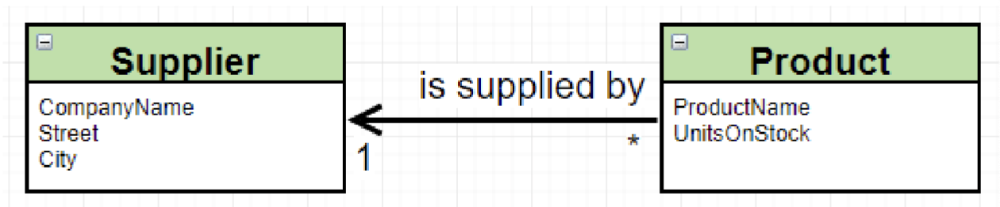
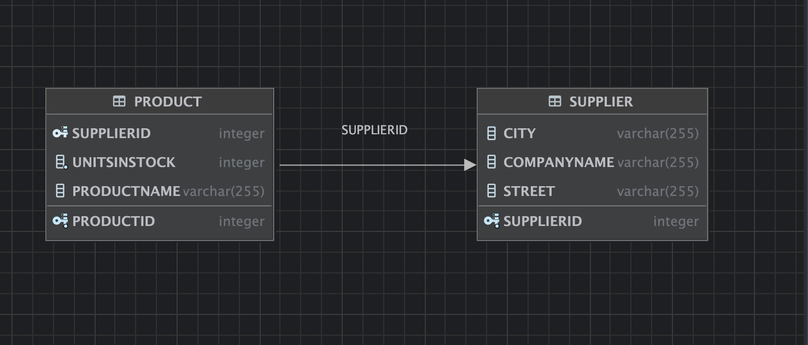

# Entity Framework

<style>
  {
    font-size: 16pt;
  }
</style> 

<style scoped>
 li, p {
    font-size: 14pt;
  }
</style> 

<style scoped>
 pre {
    font-size: 10pt;
  }
</style> 

## Autorzy: Szymon Migas, Dawid Żak

# Część I
Sprawdzamy zainstalowaną wersję Javy:
```bash
java -version
```

Wynik:
```
java version "21.0.2" 2024-01-16 LTS
Java(TM) SE Runtime Environment (build 21.0.2+13-LTS-58)
Java HotSpot(TM) 64-Bit Server VM (build 21.0.2+13-LTS-58, mixed mode, sharing)
```

Po pobraniu i rozpakowaniu serwera Derby, przechodzimy do katalogu `bin` i uruchamiamy serwer:
```bash
cd hibernate/db-derby-10.17.1.0-bin/bin
./startNetworkServer
```

Wynik na konsoli:


Następnie w Intelliju tworzymy nowy projekt Mavenowy, w którym dodajemy zależności do Hibernate i Derby.

Tworzenie nowego projektu Mavenowego:


Testowe uruchomienie projektu:


Dodajemy zależności do pliku `pom.xml`:
```xml
<?xml version="1.0" encoding="UTF-8"?>
<project xmlns="http://maven.apache.org/POM/4.0.0"
         xmlns:xsi="http://www.w3.org/2001/XMLSchema-instance"
         xsi:schemaLocation="http://maven.apache.org/POM/4.0.0 http://maven.apache.org/xsd/maven-4.0.0.xsd">
...

    <dependencies>
        <dependency>
            <groupId>org.hibernate</groupId>
            <artifactId>hibernate-core</artifactId>
            <version>6.4.4.Final</version>
        </dependency>

        <dependency>
            <groupId>org.apache.derby</groupId>
            <artifactId>derbyclient</artifactId>
            <version>10.17.1.0</version>
        </dependency>

        <dependency>
            <groupId>org.apache.derby</groupId>
            <artifactId>derbynet</artifactId>
            <version>10.17.1.0</version>
        </dependency>
    </dependencies>

</project>
```
Moduły w projekcie po przeładowaniu zależności:


Kofiguracja Hibernate w pliku `hibernate.cfg.xml`:
```xml
<?xml version="1.0" encoding="UTF-8"?>
<!DOCTYPE hibernate-configuration PUBLIC
        "-//Hibernate/Hibernate Configuration DTD 3.0//EN"
        "http://www.hibernate.org/dtd/hibernate-configuration-3.0.dtd">
<hibernate-configuration>
    <session-factory>

        <property name="connection.driver_class">
            org.apache.derby.jdbc.ClientDriver
        </property>

        <property name="connection.url">
            jdbc:derby://127.0.0.1/MyLabDatabase;create=true
        </property>


        <property name="show_sql">true</property>
        <property name="format_sql">true</property>
        <property name="use_sql_comments">true</property>
        <property name="hbm2ddl.auto">create-drop</property>

    </session-factory>
</hibernate-configuration>
```

Uzupełniamy klasę `Main`:

```java
package org.example;

import org.hibernate.Session;
import org.hibernate.SessionFactory;
import org.hibernate.cfg.Configuration;

public class Main {
    private static SessionFactory sessionFactory = null;

    public static void main(String[] args) {
        sessionFactory = getSessionFactory();
        Session session = sessionFactory.openSession();
        session.close();
    }
    
    private static SessionFactory getSessionFactory() {
        if (sessionFactory == null) {
            Configuration configuration = new Configuration();
            sessionFactory = configuration.configure().buildSessionFactory();
        }
        return sessionFactory;
    }
}
```

Uruchamiamy projekt, aby sprawdzić, czy Hibernate poprawnie łączy się z bazą danych Derby:


Dodajemy do Intellij bazę danych Derby:


Widać że połączenie się powiodło, póki co otrzymujemy:


Następnie w celu dodania do bazy danych nowych danych, tworzymy klasę `Product`:
```java
package org.example;

import jakarta.persistence.Entity;
import jakarta.persistence.GeneratedValue;
import jakarta.persistence.GenerationType;
import jakarta.persistence.Id;

@Entity
public class Product {
    @Id
    @GeneratedValue(strategy = GenerationType.AUTO)
    private int productID;
    private String productName;
    private int unitsInStock;

    public Product() {

    }

    public Product(String productName, int unitsInStock) {
        this.productName = productName;
        this.unitsInStock = unitsInStock;
    }
}
```

Oraz w klasie `Main` dodajemy sekcję tworzącą nową transakcję i zapisującą do bazy danych nowy produkt:
```java
...
    public static void main(String[] args) {
        sessionFactory = getSessionFactory();
        Session session = sessionFactory.openSession();

// *******************************************************************
        Product product = new Product("Kredki", 100);
        Transaction tx = session.beginTransaction();
        session.persist(product);
        tx.commit();
 // *******************************************************************
        
        session.close();
    }

    ...
```

Ponieważ 
```java
    transaction.save(...);
```
jest przestarzałe od wersji 6.0, używamy:
```java
    session.persist(...);
```

Przed uruchomieniem projektu, dodajemy mapping klasy `Product` w pliku `hibernate.cfg.xml`:
```xml
...
    <mapping class="org.example.Product"/>
...
```

Wynik po uruchomieniu:


W bazie danych pojawił się nowy produkt:


# Część II
## Zadanie I
Zmodyfikuj model wprowadzając pojęcie Dostawcy jak poniżej:

- stwórz nowego dostawcę
- Znajdz poprzednio wprowadzony produkt i ustaw jego dostawce na właśnie dodanego

Zaczynamy od stworzenia klasy `Supplier`:
```java
package org.example;

import jakarta.persistence.Entity;
import jakarta.persistence.GeneratedValue;
import jakarta.persistence.GenerationType;
import jakarta.persistence.Id;

@Entity
public class Supplier {
    @Id
    @GeneratedValue(strategy = GenerationType.AUTO)
    private String companyName;
    private String street;
    private String city;

    public Supplier() {

    }

    public Supplier(String companyName, String street, String city) {
        this.companyName = companyName;
        this.street = street;
        this.city = city;
    }
}
```

Zmieniona klasa `Product`:
```java
...
@Entity
public class Product {
    ...
    @ManyToOne
    @JoinColumn(name = "supplierID")
    private Supplier supplier;

    ...

    public Product(String productName, int unitsInStock, Supplier supplier) {
        this.productName = productName;
        this.unitsInStock = unitsInStock;
        this.supplier = supplier;
    }

    public void setSupplier(Supplier supplier) {
        this.supplier = supplier;
    }
}

```

Aby zmienić zachowanie hibernate, podczas uruchamiania projektu zmieniamy plik `hibernate.cfg.xml`:
```xml
 <property name="hbm2ddl.auto">update</property>
```

Zmiana ta spowoduje, że Hibernate zaktualizuje schemat bazy danych, zamiast go usuwać i tworzyć od nowa.

Klasa `main` dodająca nowego dostawcę i przypisująca go do produktu:  
```java
...

public static void main(String[] args) {
        sessionFactory = getSessionFactory();
        Session session = sessionFactory.openSession();

        Transaction tx = session.beginTransaction();

        // Create a new supplier
        Supplier supplier = new Supplier("Kredakowo", "ul. Markerowa 1", "Kraków");
        session.persist(supplier);

        // Create a new product supplied by the supplier
        Product product = session.get(Product.class, 1);
        product.setSupplier(supplier);

        session.persist(product);

        tx.commit();
        session.close();
    }
...

```

Logi przy uruchomieniu:
```
Hibernate: 
    
values
    next value for Supplier_SEQ
Hibernate: 
    select
        p1_0.productID,
        p1_0.productName,
        s1_0.supplierID,
        s1_0.city,
        s1_0.companyName,
        s1_0.street,
        p1_0.unitsInStock 
    from
        Product p1_0 
    left join
        Supplier s1_0 
            on s1_0.supplierID=p1_0.supplierID 
    where
        p1_0.productID=?
Hibernate: 
    /* insert for
        org.example.Supplier */insert 
    into
        Supplier (city, companyName, street, supplierID) 
    values
        (?, ?, ?, ?)
Hibernate: 
    /* update
        for org.example.Product */update Product 
    set
        productName=?,
        supplierID=?,
        unitsInStock=? 
    where
        productID=?

Process finished with exit code 0
```

Baza danych po uruchomieniu:


Schemat bazy danych:



## Zadanie II
Odwróć relację zgodnie z poniższym schematem:

- Zamodeluj powyższe w dwoch wariantach „z” i „bez” tabeli łącznikowej
- Stworz kilka produktow
- Dodaj je do produktow dostarczanych przez nowo stworzonego dostawcę

W tym zadaniu tworzymy relację jeden do wielu pomiędzy `Supplier` a `Product`.

Ponieważ schemat bazy danych będzie modyfikowany, wracamy do ustawienia `hbm2ddl.auto` na `create-drop` w pliku `hibernate.cfg.xml`:
```xml
<property name="hbm2ddl.auto">create-drop</property>
```

### Wariant bez tabeli łącznikowej

Z klasy `Product` usuwamy dodane w poprzednim zadaniu pola związane z relacją do `Supplier`:
```java
...

@Entity
public class Product {
    @Id
    @GeneratedValue(strategy = GenerationType.AUTO)
    private int productID;
    private String productName;
    private int unitsInStock;

    
    public Product() {

    }

    public Product(String productName, int unitsInStock) {
        this.productName = productName;
        this.unitsInStock = unitsInStock;
    }
}
```


Klasa `Supplier` z relacją jeden do wielu:
```java
...

@Entity
public class Supplier {
    ...

    @OneToMany
    @JoinColumn(name = "SUPPLIER_FK")
    private Set<Product> suppliedProducts = new HashSet<>();

    ...

    // Dodawanie produktu
    public void addSuppliedProduct(Product product) {
        suppliedProducts.add(product);
    }
}
```
Zastosowanie adnotacji `@OneToMany` i `@JoinColumn` pozwala na utworzenie relacji jeden do wielu pomiędzy `Supplier` a `Product`, gdzie `SUPPLIER_FK` jest kluczem obcym w tabeli `Product`.

W klasie `Main` tworzymy kilku dostawców i produkty, a następnie przypisujemy produkty do dostawców:
```java
 public static void main(String[] args) {
        sessionFactory = getSessionFactory();
        Session session = sessionFactory.openSession();
        Transaction tx = session.beginTransaction();
        
        // Create a new supplier
        Supplier supplier = new Supplier("Kredakowo", "ul. Markerowa 1", "Kraków");

        // Create a bunch of products
        Product product1 = new Product("Kredki", 100);
        session.persist(product1);
        supplier.addSuppliedProduct(product1);
        
        Product product2 = new Product("Ołówki", 20);
        session.persist(product2);
        supplier.addSuppliedProduct(product2);

        Product product3 = new Product("Flamaster", 120);
        session.persist(product3);
        supplier.addSuppliedProduct(product3);
        
        // Persist the supplier with its products
        session.persist(supplier);

        tx.commit();
        session.close();
    }
```

Logi przy uruchomieniu:
```
Hibernate: 
    alter table Product 
       add constraint FKeury2hxl2j8urlkmw36585tkr 
       foreign key (SUPPLIER_FK) 
       references Supplier
Hibernate: 
    
values
    next value for Product_SEQ
Hibernate: 
    
values
    next value for Product_SEQ
Hibernate: 
    
values
    next value for Supplier_SEQ
Hibernate: 
    /* insert for
        org.example.Product */insert 
    into
        Product (productName, unitsInStock, productID) 
    values
        (?, ?, ?)
Hibernate: 
    /* insert for
        org.example.Product */insert 
    into
        Product (productName, unitsInStock, productID) 
    values
        (?, ?, ?)
Hibernate: 
    /* insert for
        org.example.Product */insert 
    into
        Product (productName, unitsInStock, productID) 
    values
        (?, ?, ?)
Hibernate: 
    /* insert for
        org.example.Supplier */insert 
    into
        Supplier (city, companyName, street, supplierID) 
    values
        (?, ?, ?, ?)
Hibernate: 
    update
        Product 
    set
        SUPPLIER_FK=? 
    where
        productID=?
Hibernate: 
    update
        Product 
    set
        SUPPLIER_FK=? 
    where
        productID=?
Hibernate: 
    update
        Product 
    set
        SUPPLIER_FK=? 
    where
        productID=?

Process finished with exit code 0
```

Baza danych po uruchomieniu:


Schemat bazy danych:


Jak widać, produkty są przypisane do dostawcy poprzez klucz obcy `SUPPLIER_FK` w tabeli `Product`.

### Wariant z tabelą łącznikową
W tym wariancie tworzymy tabelę łącznikową, która będzie przechowywać relację między `Supplier` a `Product`.

Aby zaimplementować ten wariant, wystarczy usunąć adnotację `@JoinColumn` z klasy `Supplier`.

```java

@Entity
public class Supplier {
    @Id
    @GeneratedValue(strategy = GenerationType.AUTO)
    private int supplierID;
    private String companyName;
    private String street;
    private String city;

    @OneToMany
    private Set<Product> suppliedProducts = new HashSet<>();

    public Supplier() {
    }

    public Supplier(String companyName, String street, String city) {
        this.companyName = companyName;
        this.street = street;
        this.city = city;
    }

    // Dodawanie produktu
    public void addSuppliedProduct(Product product) {
        suppliedProducts.add(product);
    }
}
```

W ten sposób Hibernate sam utworzy tabelę łącznikową, o nazwie `Supplier_Product`, która będzie przechowywać relację między `Supplier` a `Product`.

Baza danych po uruchomieniu:


Logi przy uruchomieniu:
```
Hibernate: 
    drop sequence Product_SEQ restrict
Hibernate: 
    drop sequence Supplier_SEQ restrict
Hibernate: 
    create sequence Product_SEQ start with 1 increment by 50
Hibernate: 
    create sequence Supplier_SEQ start with 1 increment by 50
Hibernate: 
    create table Product (
        productID integer not null,
        unitsInStock integer not null,
        productName varchar(255),
        primary key (productID)
    )
Hibernate: 
    create table Supplier (
        supplierID integer not null,
        city varchar(255),
        companyName varchar(255),
        street varchar(255),
        primary key (supplierID)
    )
Hibernate: 
    create table Supplier_Product (
        Supplier_supplierID integer not null,
        suppliedProducts_productID integer not null unique,
        primary key (Supplier_supplierID, suppliedProducts_productID)
    )
Hibernate: 
    alter table Supplier_Product 
       add constraint FK9lle0r59trgfnn3u0j8xds67a 
       foreign key (suppliedProducts_productID) 
       references Product
Hibernate: 
    alter table Supplier_Product 
       add constraint FKjskj7cplt17tebkn930wt8ke6 
       foreign key (Supplier_supplierID) 
       references Supplier
Hibernate: 
    
values
    next value for Product_SEQ
Hibernate: 
    
values
    next value for Product_SEQ
Hibernate: 
    
values
    next value for Supplier_SEQ
Hibernate: 
    /* insert for
        org.example.Product */insert 
    into
        Product (productName, unitsInStock, productID) 
    values
        (?, ?, ?)
Hibernate: 
    /* insert for
        org.example.Product */insert 
    into
        Product (productName, unitsInStock, productID) 
    values
        (?, ?, ?)
Hibernate: 
    /* insert for
        org.example.Product */insert 
    into
        Product (productName, unitsInStock, productID) 
    values
        (?, ?, ?)
Hibernate: 
    /* insert for
        org.example.Supplier */insert 
    into
        Supplier (city, companyName, street, supplierID) 
    values
        (?, ?, ?, ?)
Hibernate: 
    /* insert for
        org.example.Supplier.suppliedProducts */insert 
    into
        Supplier_Product (Supplier_supplierID, suppliedProducts_productID) 
    values
        (?, ?)
Hibernate: 
    /* insert for
        org.example.Supplier.suppliedProducts */insert 
    into
        Supplier_Product (Supplier_supplierID, suppliedProducts_productID) 
    values
        (?, ?)
Hibernate: 
    /* insert for
        org.example.Supplier.suppliedProducts */insert 
    into
        Supplier_Product (Supplier_supplierID, suppliedProducts_productID) 
    values
        (?, ?)

Process finished with exit code 0
```

Schemat bazy danych:


## Zadanie III
Zamodeluj relację dwustronną jak poniżej:


- Tradycyjnie: Stwórz kilka produktów
- Dodaj je do produktow dostarczanych przez nowo stworzonego dostawcę (pamiętaj o
poprawnej obsłudze dwustronności relacji)

W tym podpunkcie stworzymy relację bez tabeli łącznikowej.

Zmieniamy klasę `Supplier`:
```java
...

@Entity
public class Supplier {
    @Id
    @GeneratedValue(strategy = GenerationType.AUTO)
    private int supplierID;
    private String companyName;
    private String street;
    private String city;

    @OneToMany
    @JoinColumn(name = "SUPPLIER_FK")
    private Set<Product> suppliedProducts = new HashSet<>();

    public Supplier() {
    }

    public Supplier(String companyName, String street, String city) {
        this.companyName = companyName;
        this.street = street;
        this.city = city;
    }

    // Dodawanie produktu
    public void addSuppliedProduct(Product product) {
        suppliedProducts.add(product);
    }
}
```

Zmieniamy klasę `Product`:
```java
...

@Entity
public class Product {
    @Id
    @GeneratedValue(strategy = GenerationType.AUTO)
    private int productID;
    private String productName;
    private int unitsInStock;

    @ManyToOne
    private Supplier supplier;

    public Product() {

    }

    public Product(String productName, int unitsInStock) {
        this.productName = productName;
        this.unitsInStock = unitsInStock;
    }

    public void setSupplier(Supplier supplier) {
        this.supplier = supplier;
    }
}
```

Klasa `Main`:
```java
    public static void main(String[] args) {
        sessionFactory = getSessionFactory();
        Session session = sessionFactory.openSession();
        Transaction tx = session.beginTransaction();

        // Create a new supplier
        Supplier supplier = new Supplier("Kredakowo", "ul. Markerowa 1", "Kraków");

        // Create a bunch of products
        Product product1 = new Product("Kredki", 100);
        product1.setSupplier(supplier); // Set the supplier for the product
        session.persist(product1);
        supplier.addSuppliedProduct(product1);

        Product product2 = new Product("Ołówki", 20);
        product2.setSupplier(supplier); // Set the supplier for the product
        session.persist(product2);
        supplier.addSuppliedProduct(product2);

        Product product3 = new Product("Flamaster", 120);
        product3.setSupplier(supplier); // Set the supplier for the product
        session.persist(product3);
        supplier.addSuppliedProduct(product3);

        // Persist the supplier with its products
        session.persist(supplier);

        tx.commit();
        session.close();
    }
```

Logi podczas uruchomienia:
```Hibernate: 
    
values
    next value for Product_SEQ
Hibernate: 
    
values
    next value for Product_SEQ
Hibernate: 
    
values
    next value for Supplier_SEQ
Hibernate: 
    /* insert for
        org.example.Product */insert 
    into
        Product (productName, SUPPLIER_FK, unitsInStock, productID) 
    values
        (?, ?, ?, ?)
Hibernate: 
    /* insert for
        org.example.Product */insert 
    into
        Product (productName, SUPPLIER_FK, unitsInStock, productID) 
    values
        (?, ?, ?, ?)
Hibernate: 
    /* insert for
        org.example.Product */insert 
    into
        Product (productName, SUPPLIER_FK, unitsInStock, productID) 
    values
        (?, ?, ?, ?)
Hibernate: 
    /* insert for
        org.example.Supplier */insert 
    into
        Supplier (city, companyName, street, supplierID) 
    values
        (?, ?, ?, ?)
Hibernate: 
    /* update
        for org.example.Product */update Product 
    set
        productName=?,
        SUPPLIER_FK=?,
        unitsInStock=? 
    where
        productID=?
Hibernate: 
    /* update
        for org.example.Product */update Product 
    set
        productName=?,
        SUPPLIER_FK=?,
        unitsInStock=? 
    where
        productID=?
Hibernate: 
    /* update
        for org.example.Product */update Product 
    set
        productName=?,
        SUPPLIER_FK=?,
        unitsInStock=? 
    where
        productID=?
Hibernate: 
    update
        Product 
    set
        SUPPLIER_FK=? 
    where
        productID=?
Hibernate: 
    update
        Product 
    set
        SUPPLIER_FK=? 
    where
        productID=?
Hibernate: 
    update
        Product 
    set
        SUPPLIER_FK=? 
    where
        productID=?

Process finished with exit code 0
```

Wynik po uruchomieniu:


Schemat bazy danych:


## Zadanie IV
Dodaj klase `Category` z property:
```java
int CategoryID;
String name
```
oraz listą produktów:
```java
List<Product> products;
```

- Zmodyfikuj produkty dodając wskazanie na kategorie do której należy.
- Stworz kilka produktow i kilka kategorii
- Dodaj kilka produktów do wybranej kategorii
- Wydobądź produkty z wybranej kategorii oraz kategorię do której należy wybrany produkt

Zaczynamy od stworzenia klasy `Category`:
```java
...

@Entity
public class Category {
    @Id
    @GeneratedValue(strategy = GenerationType.AUTO)

    private int categoryID;
    private String name;

    @OneToMany
    @JoinColumn(name = "CATEGORY_FK")
    private Set<Product> products = new HashSet<>();

    public Category() {

    }

    public Category(String name) {
        this.name = name;
    }

    public void addProduct(Product product) {
        products.add(product);
        product.setCategory(this);
    }

    public Set<Product> getProducts() {
        return this.products;
    }

    public String getName() {
        return this.name;
    }
}
```

Zmodyfikowana klasa `Product`:
```java
...

@Entity
public class Product {
    @Id
    @GeneratedValue(strategy = GenerationType.AUTO)
    private int productID;
    private String productName;
    private int unitsInStock;

    @ManyToOne
    @JoinColumn(name = "SUPPLIER_FK")
    private Supplier supplier;

    @ManyToOne
    @JoinColumn(name = "CATEGORY_FK")
    private Category category;

    public Product() {

    }

    public Product(String productName, int unitsInStock) {
        this.productName = productName;
        this.unitsInStock = unitsInStock;
    }

    public void setSupplier(Supplier supplier) {
        this.supplier = supplier;
    }

    public void setCategory(Category category) {
        this.category = category;
    }

    public Category getCategory() {
        return this.category;
    }

    public String getProductName() {
        return this.productName;
    }
}

```

Klasa `Main`:
```java
...

public class Main {
    ...

    public static void main(String[] args) {
        sessionFactory = getSessionFactory();
        Session session = sessionFactory.openSession();
        Transaction tx = session.beginTransaction();

        // Create a new supplier
        Supplier supplier = new Supplier("Kredakowo", "ul. Markerowa 1", "Kraków");


        // Create new categories
        Category biurowe = new Category("Biurowe");
        Category szkolne = new Category("Szkolne");

        // Create a bunch of products
        Product product1 = new Product("Długopis", 100);
        product1.setSupplier(supplier);
        biurowe.addProduct(product1);
        session.persist(product1);
        supplier.addSuppliedProduct(product1);

        Product product2 = new Product("Zszywacz", 20);
        product2.setSupplier(supplier);
        biurowe.addProduct(product2);
        session.persist(product2);
        supplier.addSuppliedProduct(product2);

        Product product3 = new Product("Zeszyt", 120);
        product3.setSupplier(supplier);
        szkolne.addProduct(product3);
        session.persist(product3);
        supplier.addSuppliedProduct(product3);

        // Persist supplier and categories
        session.persist(supplier);

        session.persist(biurowe);
        session.persist(szkolne);

        tx.commit();
        // Fetch products from Category
        var query = session.createQuery("from Category c  where c.name = 'Biurowe'");
        Category rCat = (Category) query.getSingleResult();
        for (Product p : rCat.getProducts()) {
            System.out.println("Produkt w kategorii " + rCat.getName() + ": " + p.getProductName());
        }

        query = session.createQuery("from Product p where p.productName = 'Zeszyt'");
        Product rProd = (Product) query.getSingleResult();
        System.out.println("Produkt: " + rProd.getProductName() + ", kategoria: " + rProd.getCategory().getName());

        session.close();
    }

    private static SessionFactory 
}
```

Logi przy uruchomieniu:
```
Hibernate: 
    create table Category (
        categoryID integer not null,
        name varchar(255),
        primary key (categoryID)
    )
Hibernate: 
    create table Product (
        CATEGORY_FK integer,
        SUPPLIER_FK integer,
        productID integer not null,
        unitsInStock integer not null,
        productName varchar(255),
        primary key (productID)
    )
...
```
Produkty w kategorii Biurowe wypisane podczas uruchomienia:
```
Produkt w kategorii Biurowe: Zszywacz
Produkt w kategorii Biurowe: Długopis
```

Kategoria wybranego produktu:
```
Produkt: Zeszyt, kategoria: Szkolne
```

Baza danych po uruchomieniu:


Schemat bazy po uruchomieniu:


## Zadanie V
Zamodeluj relację wiele do wielu jak poniżej:


- Stwórz kilka produktów i "sprzedaj" je w kilku tranksakcjach
- Pokaż produkty sprzedane w ramach wybranej transakcji
- Pokaz faktury w ramach których był sprzedany wybrany produkt

Stworzona klasa `Invoice`:
```java

@Entity
public class Invoice {
    @Id
    @GeneratedValue(strategy = GenerationType.AUTO)
    private int invoiceID;

    private int number;
    private int quantity;

    @ManyToMany
    private Set<Product> products = new HashSet<>();

    public Invoice() {

    }

    public void addProduct(Product product, int quantity) {
        products.add(product);
        this.quantity += quantity;
        product.addToInvoice(this, quantity);
    }

    public void setNumber(int number) {
        this.number = number;
    }

    public int getNumber() {
        return number;
    }

    @Override
    public String toString() {
        StringBuilder sb = new StringBuilder();
        sb.append("Invoice ID: ").append(invoiceID).append("\n");
        sb.append("Number: ").append(number).append("\n");
        sb.append("Quantity: ").append(quantity).append("\n");
        sb.append("Products:\n");
        for (Product product : products) {
            sb.append("- ").append(product.getProductName()).append("\n");
        }
        return sb.toString();
    }
}
```

Zmieniona klasa `Product`:
```java
package org.example;

import jakarta.persistence.*;

import java.util.HashSet;
import java.util.Set;

@Entity
public class Product {
    ...

    @ManyToMany
    private Set<Invoice> invoices = new HashSet<>();

    ...

    public String getProductName() {
        return this.productName;
    }

    public void addToInvoice(Invoice invoice, int quantity) {
        invoices.add(invoice);
    }

    public Set<Invoice> getInvoices() {
        return this.invoices;
    }
}
```

Zmieniona klasa `Main`:
```java
public static void main(String[] args) {
        sessionFactory = getSessionFactory();
        Session session = sessionFactory.openSession();
        Transaction tx = session.beginTransaction();

        // Create a new supplier
        Supplier supplier = new Supplier("Kredakowo", "ul. Markerowa 1", "Kraków");


        // Create new categories
        Category biurowe = new Category("Biurowe");
        Category szkolne = new Category("Szkolne");

        // Create a bunch of products
        Product product1 = new Product("Długopis", 100);
        product1.setSupplier(supplier);
        biurowe.addProduct(product1);
        session.persist(product1);
        supplier.addSuppliedProduct(product1);

        Product product2 = new Product("Zszywacz", 20);
        product2.setSupplier(supplier);
        biurowe.addProduct(product2);
        session.persist(product2);
        supplier.addSuppliedProduct(product2);

        Product product3 = new Product("Zeszyt", 120);
        product3.setSupplier(supplier);
        szkolne.addProduct(product3);
        session.persist(product3);
        supplier.addSuppliedProduct(product3);

        // Persist supplier and categories
        session.persist(supplier);

        session.persist(biurowe);
        session.persist(szkolne);

        // Create new invoices
        Invoice invoice = new Invoice();
        invoice.setNumber(1);

        invoice.addProduct(product1, 2);
        invoice.addProduct(product3, 30);


        Invoice invoice2 = new Invoice();
        invoice2.setNumber(2);

        invoice2.addProduct(product1, 2);
        invoice2.addProduct(product2, 1);
        invoice2.addProduct(product3, 5);

        session.persist(invoice);
        session.persist(invoice2);

        tx.commit();

        var query = session.createQuery("from Invoice i where i.number = 1");
        Invoice rInvoice = (Invoice) query.getSingleResult();
        System.out.println(rInvoice);

        query = session.createQuery("from Product p where p.productName = 'Zeszyt'");
        Product rProd = (Product) query.getSingleResult();
        System.out.println("Produkt: " + rProd.getProductName() + " znajduje się na fakturach:");
        for(Invoice inv: rProd.getInvoices()) {
            System.out.println("- " + inv.getNumber());
        }
    }
```

Wyniki w konsoli:
```
Invoice ID: 1
Number: 1
Quantity: 32
Products:
- Zeszyt
- Długopis
```
```
Produkt: Zeszyt znajduje się na fakturach:
- 1
- 2
```

Logi:
```
Hibernate: 
    create table Invoice (
        invoiceID integer not null,
        number integer not null,
        quantity integer not null,
        primary key (invoiceID)
    )
Hibernate: 
    create table Invoice_Product (
        Invoice_invoiceID integer not null,
        products_productID integer not null,
        primary key (Invoice_invoiceID, products_productID)
    )
Hibernate: 
    create table Product (
        CATEGORY_FK integer,
        SUPPLIER_FK integer,
        productID integer not null,
        unitsInStock integer not null,
        productName varchar(255),
        primary key (productID)
    )
```

Baza danych po uruchomieniu:


Schemat bazy danych:


## Zadanie VI
JPA:
- Stwórz nowego maina w którym zrobisz to samo co w poprzednim ale z wykorzystaniem JPA

Na początku tworzymy nowy plik `persistence.xml` w katalogu `src/main/resources/META-INF/`:
```xml
<?xml version="1.0"?>
<persistence xmlns="http://java.sun.com/xml/ns/persistence"
             xmlns:xsi="http://www.w3.org/2001/XMLSchema-instance"
             xsi:schemaLocation="https://jakarta.ee/xml/ns/persistence https://jakarta.ee/xml/ns/persistence/persistence_3_0.xsd"
             version="2.0">
    <persistence-unit name="MyLabDatabase" transaction-type="RESOURCE_LOCAL">
        <properties>
            <property name="hibernate.connection.driver_class" value="org.apache.derby.jdbc.ClientDriver"/>
            <property name="hibernate.connection.url" value="jdbc:derby://localhost/MyLabDatabase"/>
            <property name="hibernate.show_sql" value="true"/>
            <property name="hibernate.format_sql" value="true"/>
            <property name="hibernate.hbm2ddl.auto" value="create-drop"/>
        </properties>
    </persistence-unit>
</persistence>
```

Zmiany w klasie `Main` dla JPA:
Usuwamy wszystkie importy Hibernate i dodajemy odpowiednie dla JPA:
```java
import jakarta.persistence.EntityManager;
import jakarta.persistence.EntityManagerFactory;
import jakarta.persistence.EntityTransaction;
import jakarta.persistence.Persistence;
```
Następnie zmieniamy klasę `Main` tak, aby używała JPA zamiast Hibernate:
```java
public static void main(String[] args) {
        // Create an EntityManagerFactory and EntityManager for JPA
        EntityManagerFactory emf = Persistence.createEntityManagerFactory("MyLabDatabase");
        EntityManager em = emf.createEntityManager();
        EntityTransaction etx = em.getTransaction();

        // tx is now etx
        etx.begin();

        // Create a new supplier
        Supplier supplier = new Supplier("Kredakowo", "ul. Markerowa 1", "Kraków");


        // Create new categories
        Category biurowe = new Category("Biurowe");
        Category szkolne = new Category("Szkolne");

        // Create a bunch of products
        Product product1 = new Product("Długopis", 100);
        product1.setSupplier(supplier);
        biurowe.addProduct(product1);
        em.persist(product1);
        supplier.addSuppliedProduct(product1);

        Product product2 = new Product("Zszywacz", 20);
        product2.setSupplier(supplier);
        biurowe.addProduct(product2);
        em.persist(product2);
        supplier.addSuppliedProduct(product2);

        Product product3 = new Product("Zeszyt", 120);
        product3.setSupplier(supplier);
        szkolne.addProduct(product3);
        em.persist(product3);
        supplier.addSuppliedProduct(product3);

        // Persist supplier and categories
        em.persist(supplier);

        em.persist(biurowe);
        em.persist(szkolne);

        // Create new invoices
        Invoice invoice = new Invoice();
        invoice.setNumber(1);

        invoice.addProduct(product1, 2);
        invoice.addProduct(product3, 30);


        Invoice invoice2 = new Invoice();
        invoice2.setNumber(2);

        invoice2.addProduct(product1, 2);
        invoice2.addProduct(product2, 1);
        invoice2.addProduct(product3, 5);

        em.persist(invoice);
        em.persist(invoice2);

        etx.commit();

        var query = em.createQuery("from Invoice i where i.number = 1");
        Invoice rInvoice = (Invoice) query.getSingleResult();
        System.out.println(rInvoice);

        query = em.createQuery("from Product p where p.productName = 'Zeszyt'");
        Product rProd = (Product) query.getSingleResult();
        System.out.println("Produkt: " + rProd.getProductName() + " znajduje się na fakturach:");
        for(Invoice inv: rProd.getInvoices()) {
            System.out.println("- " + inv.getNumber());
        }
    }
```

Wyniki:
```
Invoice ID: 1
Number: 1
Quantity: 32
Products:
- Zeszyt
- Długopis
```
```
Produkt: Zeszyt znajduje się na fakturach:
- 1
- 2
```


## Zadanie VII - Embedded class
- Dodaj do medelu klase adres. "Wbuduj ją do tabeli Dostawców"
- Zmodyfikuj model w taki sposób, że dane adresowe znajdują się w klasie dostawców. Zmapuj to do dwóch tabel.
### Wersja z wbudowaną klasą
Zaczynamy od stworzenia klasy `Address`:
```java
@Embeddable
public class Address {
    private String street;
    private String city;

    public Address() {

    }

    public Address(String street, String city) {
        this.street = street;
        this.city = city;
    }
}
```

Następnie zmieniamy klasę `Supplier`, aby używała klasy `Address`:
```java
...
@Entity
public class Supplier {
    ...

    @Embedded
    private Address address;

    public Supplier() {
    }

    public Supplier(String companyName, String street, String city) {
        this.companyName = companyName;
        this.address = new Address(street, city);
    }
    
    public Supplier(String companyName, Address address) {
        this.companyName = companyName;
        this.address = address;
    }

}
```

Klasa `Main`:
```java

public static void main(String[] args) {
        EntityManagerFactory emf = Persistence.createEntityManagerFactory("MyLabDatabase");
        EntityManager em = emf.createEntityManager();
        EntityTransaction etx = em.getTransaction();

        etx.begin();

        Address address = new Address("Barszczowa", "Burakowo");
        Supplier supplier1 = new Supplier("Buraki Sp. z o.o.", address);

        Supplier supplier2 = new Supplier("Ziemniaki Sp. z o.o.", "Ziemniaczana", "Ziemniakowo");

        em.persist(supplier1);
        em.persist(supplier2);

        var query = em.createQuery("SELECT s FROM Supplier s", Supplier.class);
        List<Supplier> suppliers = query.getResultList();

        for (Supplier supplier : suppliers) {
            System.out.println(supplier);
        }

        etx.commit();
    }
```

Wyniki w konsoli:
```
Hibernate: 
    create table Supplier (
        supplierID integer not null,
        city varchar(255),
        companyName varchar(255),
        street varchar(255),
        primary key (supplierID)
    )
```

```
Supplier ID: 1
Company Name: Buraki Sp. z o.o.
Address: Barszczowa, Burakowo
Supplied Products:

Supplier ID: 2
Company Name: Ziemniaki Sp. z o.o.
Address: Ziemniaczana, Ziemniakowo
Supplied Products:
```

Tabela `Supplier` po uruchomieniu:


### Wersja z dwoma tabelami

Klasa `Supplier`:
```java
...

@Entity
@SecondaryTable(name = "Address")
public class Supplier {
    ...

    @Column(table = "Address")
    public String street;

    @Column(table = "Address")
    public String city;

    ...

    @Override
    public String toString() {
        StringBuilder sb = new StringBuilder();
        sb.append("Supplier ID: ").append(supplierID).append("\n");
        sb.append("Company Name: ").append(companyName).append("\n");
        sb.append("Address: ").append(street + ", " + city).append("\n");
        sb.append("Supplied Products:\n");
        for (Product product : suppliedProducts) {
            sb.append("- ").append(product.getProductName()).append("\n");
        }
        return sb.toString();
    }
}

```

Klasa `Main`:
```java

public class Main {
    public static void main(String[] args) {
        EntityManagerFactory emf = Persistence.createEntityManagerFactory("MyLabDatabase");
        EntityManager em = emf.createEntityManager();
        EntityTransaction etx = em.getTransaction();

        etx.begin();

        Supplier supplier1 = new Supplier("Buraki Sp. z o.o.", "Barszczowa", "Burakowo");

        Supplier supplier2 = new Supplier("Ziemniaki Sp. z o.o.", "Ziemniaczana", "Ziemniakowo");

        em.persist(supplier1);
        em.persist(supplier2);

        var query = em.createQuery("SELECT s FROM Supplier s", Supplier.class);
        List<Supplier> suppliers = query.getResultList();

        for (Supplier supplier : suppliers) {
            System.out.println(supplier);
        }

        etx.commit();
    }
}
```


Wyniki w kosoli:
```
Hibernate: 
    create table Supplier (
        supplierID integer not null,
        companyName varchar(255),
        primary key (supplierID)
    )
Hibernate: 
    alter table Address 
       add constraint FKsg53al8nvbanq59s3pd6axyit 
       foreign key (supplierID) 
       references Supplier

```
```
Supplier ID: 1
Company Name: Buraki Sp. z o.o.
Address: Barszczowa, Burakowo
Supplied Products:

Supplier ID: 2
Company Name: Ziemniaki Sp. z o.o.
Address: Ziemniaczana, Ziemniakowo
Supplied Products:
```

Tabele po uruchomieniu:


### Zadanie VIII
Wprowadź do modelu następującą hierarchię:

- Dodaj i pobierz z bazy kilka firm obu rodzajów stosując po kolei trzy różne strategie mapowania dziedziczenia:

